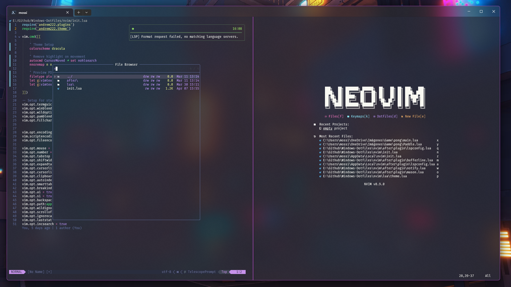
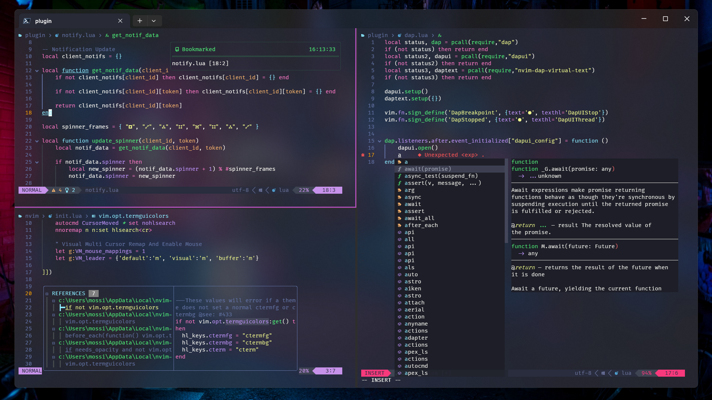
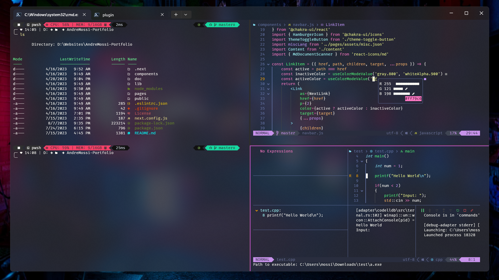
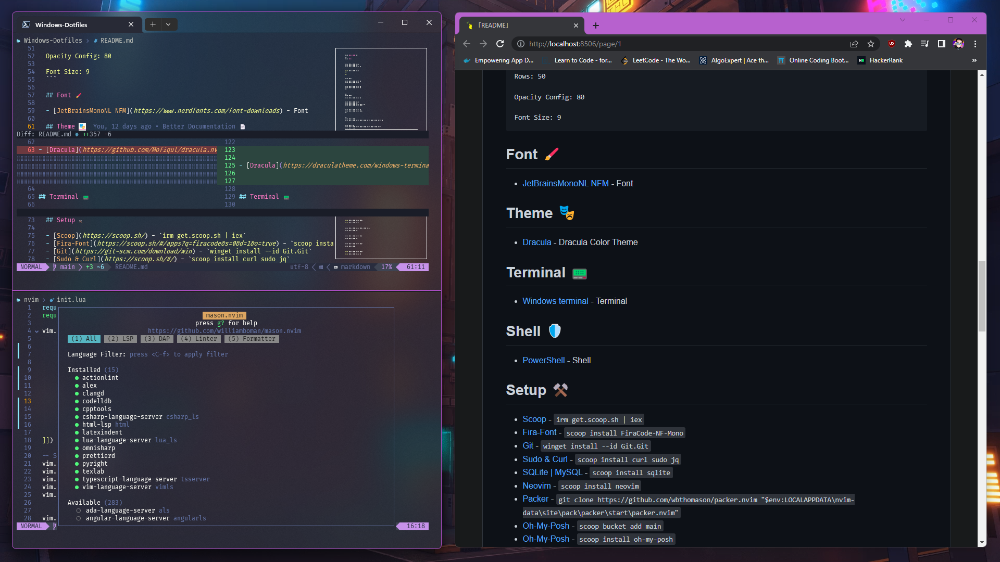

<h1>Windows Dotfiles</h1>

<p align='center'>




</p>

<h2>Windows Terminal 🖥️</h2>

```
--- Split ---

(ctrl + alt + down) - Split Down
(ctrl + alt + up) - Split Up
(ctrl + alt + right) - Split Right
(ctrl + alt + left) - Split Left
```

```
--- Resize ---

(alt + shift + down) - Resize Down
(alt + shift + up) - Resize Up
(alt + shift + right) - Resize Right
(alt + shift + left) - Resize Left
```

```
--- Windows ---

(ctrl + shift + w) - Close Window
(ctrl + shift + t) - New Window
(ctrl + tab) - Switch Tab
(alt + shift + right) - Switch Split right
(alt + shift + left) - Switch Split left
(alt + shift + up) - Switch Split up
(alt + shift + down) - Switch Split down
```

```
Duplicate Split Pane:
https://learn.microsoft.com/en-us/windows/terminal/tutorials/new-tab-same-directory

Center On Startup:
https://learn.microsoft.com/en-us/windows/terminal/customize-settings/startup

Default Size Startup:
Columns: 190
Rows: 50

Opacity Config: 80

Font Size: 9
```

<h2>Font 🖌️</h2>

- [JetBrainsMonoNL NFM](https://www.nerdfonts.com/font-downloads) - Font

<h2>Theme 🎭</h2>

- [Dracula](https://draculatheme.com/windows-terminal) - Dracula Color Theme

<h2>Terminal 📟</h2>

- [Windows terminal](https://apps.microsoft.com/store/detail/windows-terminal/9N0DX20HK701) - Terminal

<h2>Shell 🛡️</h2>

- [PowerShell](https://learn.microsoft.com/en-us/powershell/) - Shell

<h2>Setup ⚒️</h2>

- [Scoop](https://scoop.sh/) - `irm get.scoop.sh | iex`
- [Fira-Font](https://scoop.sh/#/apps?q=firacode&s=0&d=1&o=true) - `scoop install FiraCode-NF-Mono`
- [Git](https://git-scm.com/download/win) - `winget install --id Git.Git`
- [Sudo & Curl](https://scoop.sh/#/) - `scoop install curl sudo jq`
- [SQLite & MySQL](https://scoop.sh/#/apps?q=SQLITE&s=0&d=1&o=true) - `scoop install sqlite`
- [Neovim](https://scoop.sh/#/apps?q=neovim&s=0&d=1&o=true) - `scoop install neovim`
- [Packer](https://github.com/wbthomason/packer.nvim) - `git clone https://github.com/wbthomason/packer.nvim "$env:LOCALAPPDATA\nvim-data\site\pack\packer\start\packer.nvim"`
- [Oh-My-Posh](https://www.powershellgallery.com/packages/oh-my-posh) - `Install-Module oh-my-posh -Scope CurrentUser`
- [Posh-Git](https://www.powershellgallery.com/packages/posh-git) - `Install-Module posh-git -Scope CurrentUser`
- [Terminal-Icons](https://github.com/devblackops/Terminal-Icons) - `Install-Module -Name Terminal-Icons -Repository PSGallery -Force`
- [PSReadLine](https://github.com/PowerShell/PSReadLine) - `Install-Module PSReadLine -AllowPrerelease -Force`
- [Yarn](https://scoop.sh/#/) - `scoop install yarn`
- [NVM | NodeJS](https://scoop.sh/#/apps?q=nvm&s=0&d=1&o=true) - `scoop install nvm`
- [Make](https://scoop.sh/#/apps?q=make&s=0&d=1&o=true) - `scoop install make`
- [Dotnet](https://scoop.sh/#/apps?s=0&d=1&o=true&q=dotnet) - `scoop install dotnet-sdk`
- [ghq](https://scoop.sh/#/apps?s=0&d=1&o=true&q=ghq) - `scoop install ghq`
- [Comitizen](https://github.com/streamich/git-cz) - `npm install -g commitizen`
- [AltDrag](https://stefansundin.github.io/altdrag/) - `Center Window Shortcut`
- [PSFzf](https://github.com/kelleyma49/PSFzf) - `Install-Module -Name PSFzf`
- [Z Directory](https://www.powershellgallery.com/packages/z/1.1.13) - `Install-Module -Name z`
- [Zip & Unzip](https://scoop.sh/#/) - `scoop install zip unzip`
- [Bat](https://scoop.sh/#/apps?q=bat) - `scoop install bat`
- [TheFuck](https://github.com/nvbn/thefuck#installation) - `pip install thefuck`

<h2>Servers 🗃️</h2>

`Live-Server` npm install -g live-server

`Python` npm install -g pyright

`Typescript` npm install -g typescript-language-server

`C++` scoop install clangd

`Lua` scoop install lua-language-server

`C-Sharp` scoop install omnisharp

`Marksman` scoop install marksman

<h2>Format Languages 📄</h2>

`Python` pip install --upgrade autopep8

`Typescript` npm install -g prettier

`C Languages` At the setup of clang

<h2>Neovim Plugins 📲</h2>

- [Packer](https://github.com/wbthomason/packer.nvim) - Nvim Plugin Installer
- [Lualine](https://github.com/nvim-lualine/lualine.nvim) - Neovim Bar
- [nvim-Web-Devicons](https://github.com/kyazdani42/nvim-web-devicons) - Icons
- [Nvim-Tree](https://github.com/kyazdani42/nvim-tree.lua) - Neovim Tree
- [LSPConfig](https://github.com/neovim/nvim-lspconfig) - Keys Configuration
- [Plenary](https://github.com/nvim-lua/plenary.nvim) - Plenary
- [Telescope](https://github.com/nvim-telescope/telescope.nvim) - Telescope
- [Telescope Browser](https://github.com/nvim-telescope/telescope-file-browser.nvim) - Telescope File Browser
- [Markdown Preview](https://github.com/iamcco/markdown-preview.nvim) - Live Markdown Preview
- [Nvim-CMP](https://github.com/hrsh7th/nvim-cmp) - Auto Complete Setup
- [Lspkind-Nvim](https://github.com/onsails/lspkind.nvim) - Icons for Nvim LSP
- [Mason-nvim](https://github.com/williamboman/mason.nvim) - Language server installer
- [Mason-Null-LS](https://github.com/jay-babu/mason-null-ls.nvim) - Integrate Null-LS with Mason
- [Mason-LspConfig](https://github.com/williamboman/mason-lspconfig.nvim) - Integrate LspConfig with mason 
- [Mason-Dap](https://github.com/jay-babu/mason-nvim-dap.nvim) - Integrate Dap With Mason
- [Buffer-Line](https://github.com/akinsho/bufferline.nvim) - File Tabs
- [Git-Signs](https://github.com/lewis6991/gitsigns.nvim) - Git Changes Sign Bar
- [Treesitter](https://github.com/nvim-treesitter/nvim-treesitter) - Highlight Functions
- [Comment](https://github.com/numToStr/Comment.nvim) - Commenter For Languages
- [Auto-Pair](https://github.com/jiangmiao/auto-pairs) - Auto Pair Characters
- [Close-Tag](https://github.com/windwp/nvim-ts-autotag) - Close Tags
- [LuaSnip](https://github.com/L3MON4D3/LuaSnip) - Snippets
- [Hexokinase](https://github.com/RRethy/vim-hexokinase) - Color Preview
- [Null-LS](https://github.com/jose-elias-alvarez/null-ls.nvim) - Formatting Languages
- [Indent-Blankline](https://github.com/lukas-reineke/indent-blankline.nvim) - Indent Lines
- [Nvim-Notify](https://github.com/rcarriga/nvim-notify) - Animated Notifications
- [Lspsaga](https://github.com/glepnir/lspsaga.nvim) - LSP UI
- [DiffView](https://github.com/sindrets/diffview.nvim) - Visual Git
- [DAP](https://github.com/mfussenegger/nvim-dap) - Debugger
- [DAP-UI](https://github.com/rcarriga/nvim-dap-ui) - Debugger UI
- [DAP-Virtual-Text](https://github.com/theHamsta/nvim-dap-virtual-text) - Debugger Text Highlight
- [Nvim-UFO](https://github.com/kevinhwang91/nvim-ufo) - Folding Design
- [Vim-Illuminate](https://github.com/RRethy/vim-illuminate) - Highlight
- [Nvim-Surround](https://github.com/kylechui/nvim-surround) - Sorround Selection With Desired Character
- [Vim-Visual-Multi](https://github.com/mg979/vim-visual-multi) - Multiple Cursors Like Submlime
- [Harpoon](https://github.com/ThePrimeagen/harpoon) - Bookmark

<h2>Compilers And Intrepeters ⚙️</h2>

- [NodeJS](https://scoop.sh/#/apps?s=0&d=1&o=true&q=nodejs) - scoop install nodejs

- [CPP - CLANG](https://scoop.sh/#/apps?q=llvm&s=0&d=1&o=true) - scoop install mingw-winlibs-llvm

- [Python](https://www.python.org/downloads/) - Python Compiler

<h2>Directory Structure 🗂️</h2>

```
📂 $HOME/AppData/Local/Nvim
|__📂after/plugin
|__📂lua/andrem222
|   |__📄plugins.lua
|   |__📄theme.lua
|__📄init.lua

📂$HOME/.config/powershell
|__📄user_profile.ps1
|__📂themes
    |__📄minimalNight.omp.json
```

<h2>Info ℹ️</h2>

Read: `To visualize on vim the keybindings press F3. I also documented all my custom bindings.`

<details>

<summary>Custom Mappings ⌨️</summary>

`\ + f` - Telescope Find Files

`\ + r` - Telescope Live Grep

`\ + \ + \` - Telescope Buffers

`\ + t` - Telescope

`\ + r` - Telescope Resume Search

`\ + w` - Telescope Diagnostics

`F2` - Telescope Help Tags

`F3` - Telescope Keymaps

`F5` - Lsp Status

`F6` - Null-LS Status

`\ + P` - Markdown Preview Toggle

`Ctrl - s` - Save

`Ctrl - Alt - s` Save All

`Alt - w` - Save And Quit All

`Alt - q` - Force Quit

`Ctrl - Alt - q` - Force Quit All

`Alt - Up` - Move Line | Block up

`Alt - Down` - Move Line | Block Down

`Alt - Left` - Move Line | Block Left

`Alt - Right` - Move Line | Block Right

`Shift - f` - Format

`CTRL - c` - Color Picker

`f` - Lspsaga Hover Doc

`g + d` - lspsaga Finder

`g + p` - Lspsaga Code Actions

`Ctrl - j` - Lspsaga Jump Diagnostic Forward

`Ctrl - Shift- j` - Lspsaga Jump Diagnostic Reverse

`g - l` - Lspsaga Line Diagnostic

`g + r` - Lspsaga Rename

`Ctrl - Alt - k` - Increase Pane Vertical

`Ctrl - Alt - i` - Decrease Pane Vertical

`Ctrl - Alt - l` - Increase Pane Horizontal

`Ctrl - Alt - j` - Decrease Pane Horizontal

`Alt - Shift - i` - Pane Move Up

`Alt - Shift - k` - Pane Move Down

`Alt - Shift - j` - Pane Move Left

`Alt - Shift - l` - Pane Move Right

`F9` - Debugger Continue

`F10` - Debugger Step Over

`F11` - Debugger Step Into

`F12` - Debugger Step Out

`b` - Debugger Breakpoint

`B` - Debugger Breakpoint With Conditions

`lp` - Debugger Breakpoint With Log Message

`dr` - Debugger Toggle

`\g` - Git Diff Preview

`Shift - g` - Git Toggle Diff Preference

`=` - Open Fold

`-` - Close Fold

`+` - Open All Folds

`_` - Close All Folds

`CTRL - /` - Comment Line In Line

`CTRL - Alt - /` - Comment BLock

`CTRL - Shift - a` - Select All

`CTRL - p` - Add Cursor At Current Position

`CTRL - h` - Open Harpoon UI

`K` - Save Harpoon Mark
</details>

<details>
<summary>Debugging 🐞</summary>

Problem: `Icons are not showing completly`

Fix:
```
Some fonts do not work well with some color themes and can cause that issue or the terminal. 
You have to try until you find the right font, switch the theme, terminal or make tweaks by yourself. Generaly fonts ending with mono work.
```
problem: `Transparency Not Available`

Fix: 
```
Check you enabled transparency in the temrinal. If you still encounter
problems then you probably have to enable it from your nvim configuration.
Dracula theme transparency is not sufficient so some tweaks are requried.
For example:
                colors = { bg = "NONE" },
                transparent_bg = true,
                show_end_of_buffer = true,
                overrides = {
                    EndOfBuffer = { fg = "#282A36" }
                },

This will disable the background from dracula so transparency can be seen.
```

Problem: `C-Sharp not running`

Fix: `You are required to create a project for it to work`

Problem: `Customize format`

Fix:
```
Look for the documentation to make the changes on the CLI.

For clang-format: https://clang.llvm.org/docs/ClangFormat.html
For prettier: https://prettier.io/docs/en/options.html#vue-files-script-and-style-tags-indentation
```

Problem: `Commitizen opening editor instead of commit options`

Fix:
```
Friendly setup for commitizen globally:
npm install -g commitizen cz-conventional-changelog && echo '{ "path": "cz-conventional-changelog" }' > ~/.czrc
```

Problem: `Scoop buckets wont update`

Fix:
```
scoop config SCOOP_BRANCH master
scoop update
```

</details>
