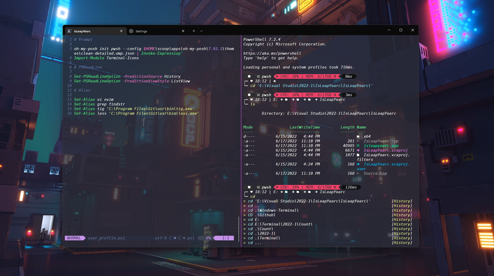

# Windows Terminal

<p>

</p>

## Windows Terminal Keybindings

```
--- Split ---

(ctrl + alt + down) - Split Down
(ctrl + alt + up) - Split Up
(ctrl + alt + right) - Split Right
(ctrl + alt + left) - Split Left
```

```
--- Resize ---

(alt + shift + down) - Resize Down
(alt + shift + up) - Resize Up
(alt + shift + right) - Resize Right
(alt + shift + left) - Resize Left
```

```
--- Windows ---

(ctrl + shift + w) - Close Window
(ctrl + shift + t) - New Window
(ctrl + tab) - Switch Tab
(alt + right) - Switch Split right
(alt + left) - Switch Split left
(alt + up) - Switch Split up
(alt + down) - Switch Split down
```

## Fonts

- [DejaVuSansMono Nerd Font](https://www.nerdfonts.com/font-downloads) - Font

## Setup

- [Scoop](https://scoop.sh/) - `irm get.scoop.sh | iex`
- [Git](https://git-scm.com/download/win) - `winget install --id Git.Git`
- [Sudo & Curl](https://scoop.sh/#/) - `scoop install curl sudo jq`
- [SQLite | MySQL](https://scoop.sh/#/apps?q=SQLITE&s=0&d=1&o=true) - `scoop install sqlite` 
- [Neovim](https://scoop.sh/#/apps?q=neovim&s=0&d=1&o=true) - `scoop install neovim`
- [Oh-My-Posh](https://scoop.sh/#/apps?q=oh+my+posh&s=0&d=1&o=true) - `scoop bucket add main`
- [Oh-My-Posh](https://scoop.sh/#/apps?q=oh+my+posh&s=0&d=1&o=true) - `scoop install oh-my-posh`
- [Terminal-Icons](https://github.com/devblackops/Terminal-Icons) - `Install-Module -Name Terminal-Icons -Repository PSGallery -Force`
- [PSReadLine](https://github.com/PowerShell/PSReadLine) - `Install-Module PSReadLine -AllowPrerelease -Force`
- [Yarn & NodeJS](https://scoop.sh/#/) - `scoop install nodejs yarn`
- [NVM](https://scoop.sh/#/apps?q=nvm&s=0&d=1&o=true) - `scoop install nvm`
- [Make](https://scoop.sh/#/apps?q=make&s=0&d=1&o=true) - `scoop install make`

## Servers

`Http-Server` npm i -g http-server

`Python` npm i -g pyright

`Typescript` npm i -g typescript-language-server

`C++` scoop install gcc

`Lua` scoop install lua-language-server

## Neovim Plugins

- [Lualine](https://github.com/nvim-lualine/lualine.nvim) - Neovim Bar
- [nvim-Web-Devicons](https://github.com/kyazdani42/nvim-web-devicons) - Icons
- [Nvim-Tree](https://github.com/kyazdani42/nvim-tree.lua) - Neovim Tree
- [Dracula](https://draculatheme.com/) - Dracula Color Theme
- [LSPConfig](https://github.com/neovim/nvim-lspconfig) - Keys Configuration
- [Plenary](https://github.com/nvim-lua/plenary.nvim) - Plenary
- [Telescope](https://github.com/nvim-telescope/telescope.nvim) - Telescope
- [Makrdown Preview](https://github.com/iamcco/markdown-preview.nvim) - Live Markdown Preview
- [Nvim-CMP](https://github.com/hrsh7th/nvim-cmp) - Auto Complete Setup
- [Lspkind-Nvim](https://github.com/onsails/lspkind.nvim) - Icons for Nvim LSP
- [Nvim-Lsp-Installer](https://github.com/williamboman/nvim-lsp-installer) - Auto complete language server installer
- [Buffer-Line](https://github.com/akinsho/bufferline.nvim) - File Tabs
- [Git-Signs](https://github.com/lewis6991/gitsigns.nvim) - Git Changes Sign Bar
- [Treesitter](https://github.com/nvim-treesitter/nvim-treesitter) - Highlight Functions
- [Comment](https://github.com/numToStr/Comment.nvim) - Commenter For Languages
- [Auto-Pair](https://github.com/jiangmiao/auto-pairs) - Auto Pair Characters
- [Close-Tag](https://github.com/alvan/vim-closetag) - Close Tags
- [LuaSnip](https://github.com/L3MON4D3/LuaSnip) - Snippets
- [Hexokinase](https://github.com/RRethy/vim-hexokinase) - Color Preview

## Neovim Keybindings

`\ + f` - Telescope Find Files

`\ + r` - Telescope Live Grep

`\ + \` - Telescope Buffers

`\ + h` - Telescope Help Tags

`\ + t` - Neovim Tree
 
`\ + m` - Markdown Preview On

`\ + n` - Markdown Preview Off

`Ctrl - s` - Save

`Ctrl - w` - Save And Quit
 
`Alt - q` - Force Quit

`Shift - Up` - Move Line | Block up

`Shift - Down` - Move Line | Block Down
