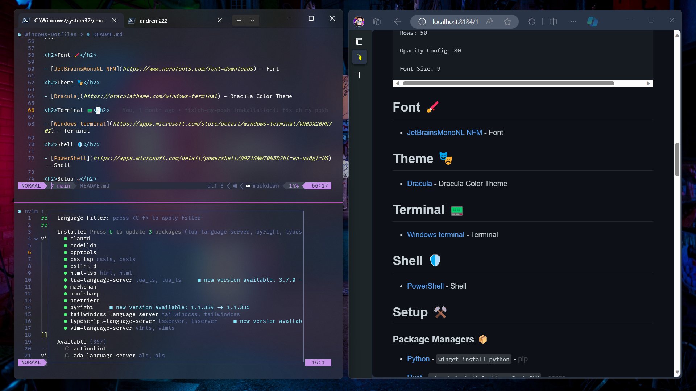

<h1>Windows Dotfiles</h1>

<p align='center'>



</p>

> [!WARNING]
> Do not run the autosetup script in your computer if you do not know what it does.
> When run it will install and configure everything in your computer.
> Git cloning for powershell and nvim is used to make it fast to update when new changes are made
> The following is the link to the autosetup script: DO NOT RUN WITHOUT READING WHAT THE SCRIPT DOES
> ```
> Invoke-RestMethod https://raw.githubusercontent.com/AndreM222/Windows-Dotfiles/master/autoSetup.ps1 | Invoke-Expression 
> ```

<h2>Dependencies 📃</h2>

- Neovim >= 0.9.0 (needs to be built with LuaJIT)

- Git >= 2.19.0 (for partial clones support)

- Nerd Fonts >= 3.0

<h2>Contents 📦</h2>

- Neovim Configuration

- Powershell Configuration

- Git Configuration

- Windows Terminal Configuration

<h2>Windows Terminal 🖥️</h2>

```
--- Split ---
(ctrl + alt + down) - Split Down
(ctrl + alt + up) - Split Up
(ctrl + alt + right) - Split Right
(ctrl + alt + left) - Split Left
```

```
--- Resize ---

(alt + shift + down) - Resize Down
(alt + shift + up) - Resize Up
(alt + shift + right) - Resize Right
(alt + shift + left) - Resize Left
```

```
--- Windows ---

(ctrl + shift + w) - Close Window
(ctrl + shift + t) - New Window
(ctrl + tab) - Switch Tab
(alt + shift + right) - Switch Split right
(alt + shift + left) - Switch Split left
(alt + shift + up) - Switch Split up
(alt + shift + down) - Switch Split down
```

```
Duplicate Split Pane:
https://learn.microsoft.com/en-us/windows/terminal/tutorials/new-tab-same-directory

Center On Startup:
https://learn.microsoft.com/en-us/windows/terminal/customize-settings/startup

Default Size Startup:
Columns: 190
Rows: 50

Opacity Config: 80

Font Size: 9
```

<h2>Font 🖌️</h2>

- [JetBrainsMonoNL NFM](https://www.nerdfonts.com/font-downloads) - Font

<h2>Theme 🎭</h2>

- [Dracula](https://draculatheme.com/windows-terminal) - Dracula Color Theme

<h2>Terminal 📟</h2>

- [Windows terminal](https://apps.microsoft.com/store/detail/windows-terminal/9N0DX20HK701) - Terminal

<h2>Shell 🛡️</h2>

- [PowerShell](https://apps.microsoft.com/detail/powershell/9MZ1SNWT0N5D?hl=en-us&gl=US) - Shell

<h2>Setup ⚒️</h2>

<h5>Package Managers 📦</h5>

- [Python](https://www.python.org/) - `winget install python` - <span style="opacity:30%">pip</span>

- [Rust](https://www.rust-lang.org/) - `winget install Rustlang.Rust.GNU` - <span style="opacity:30%">cargo</span>

- [Scoop](https://scoop.sh/) - `irm get.scoop.sh | iex` - <span style="opacity:30%">scoop</span>

- [NVM | NodeJS](https://github.com/coreybutler/nvm-windows) - <span style="opacity:30%">npm</span>
```
winget install CoreyButler.NVMforWindows
nvm install lts
nvm use lts
```

<h5>Winget - Windows Installed</h5>

- [Git](https://git-scm.com/download/win) - `winget install Git.Git`
- [Sudo & Jq](https://winget.run/) - `winget install gsudo jqlang.jq`
- [SQLite & MySQL](https://sqlite.org/index.html) - `winget install SQLite.SQLite`
- [Neovim](https://winget.run/search?query=neovim) - `winget install Neovim`
- [Oh-My-Posh](https://ohmyposh.dev/docs/installation/windows) - `winget install JanDeDobbeleer.OhMyPosh -s winget`
- [Yarn](https://yarnpkg.com/) - `winget install Yarn.Yarn`
- [Make](https://www.gnu.org/software/make/) - `winget install GnuWin32.Make`
- [Fzf](https://github.com/junegunn/fzf) - `winget install fzf`
- [Bat](https://github.com/sharkdp/bat) - `winget install sharkdp.bat`
- [LazyDocker](https://github.com/jesseduffield/lazydocker) - `winget install lazydocker`
- [NTop](https://github.com/gsass1/NTop) - `winget install ntop`
- [RipGrep](https://github.com/BurntSushi/ripgrep) - `winget install BurntSushi.ripgrep.MSVC`
- [LazyGit](https://github.com/jesseduffield/lazygit) - `winget install lazygit`

<h5>Scoop - Needs Installation</h5>

- [Fira-Font](https://github.com/ryanoasis/nerd-fonts) - `scoop install FiraCode-NF-Mono`

<h5>Cargo - Needs Installation</h5>

- [Gen-License](https://github.com/nexxeln/license-generator) - `cargo install gen-license`

<h5>Powershell - Powershell Installed</h5>

- [PSFzf](https://github.com/kelleyma49/PSFzf) - `Install-Module -Name PSFzf`
- [Posh-Git](https://www.powershellgallery.com/packages/posh-git) - `Install-Module posh-git -Scope CurrentUser`
- [Terminal-Icons](https://github.com/devblackops/Terminal-Icons) - `Install-Module -Name Terminal-Icons -Repository PSGallery -Force`
- [PSReadLine](https://github.com/PowerShell/PSReadLine) - `Install-Module PSReadLine -AllowPrerelease -Force`
- [Z Directory](https://www.powershellgallery.com/packages/z/1.1.13) - `Install-Module -Name z`

<h5>NodeJS - Needs Installation</h5>

- [Comitizen](https://github.com/streamich/git-cz)
```
npm install -g commitizen
npm install -g cz-conventional-changelog

In Your Home Folder:
echo '{ "path": "cz-conventional-changelog" }' > ~/.czrc
```

- [Npm-Check-Updates](https://www.npmjs.com/package/npm-check-updates) - `npm install -g npm-check-updates`

<h2>Neovim Plugins 📲</h2>

- [Lualine](https://github.com/nvim-lualine/lualine.nvim) - Neovim Bar
  <details> <summary>Dependencies</summary>
    
  - [Copilot-Lualine](https://github.com/AndreM222/copilot-lualine) - Copilot Status Setup
  </details>

- [nvim-Web-Devicons](https://github.com/kyazdani42/nvim-web-devicons) - Icons
- [Nvim-Tree](https://github.com/kyazdani42/nvim-tree.lua) - Neovim Tree
- [LSPConfig](https://github.com/neovim/nvim-lspconfig) - Keys Configuration
- [Telescope](https://github.com/nvim-telescope/telescope.nvim) - Telescope
  <details> <summary>Dependencies</summary>
    
  - [Plenary](https://github.com/nvim-lua/plenary.nvim) - Lua Files Setup
    
  - [Telescope-File-Browser](https://github.com/nvim-telescope/telescope-file-browser.nvim) - Browsing Setup
  
  - [Telescope-UI-Select](https://github.com/nvim-telescope/telescope-ui-select.nvim) - Select UI Setup
  </details>

- [Markdown Preview](https://github.com/iamcco/markdown-preview.nvim) - Live Markdown Preview
- [Nvim-CMP](https://github.com/hrsh7th/nvim-cmp) - Auto Complete Setup
  <details> <summary>Dependencies</summary>
    
  - [CMP-Nvim-LSP](https://github.com/hrsh7th/cmp-nvim-lsp) - LSP Setup
    
  - [CMP-Buffer](https://github.com/hrsh7th/cmp-buffer) - Buffer Setup
  
  - [Copilot-CMP](https://github.com/hrsh7th/cmp-copilot) - Copilot Setup
  </details>

- [Lspkind-Nvim](https://github.com/onsails/lspkind.nvim) - Icons for Nvim LSP
- [Mason-nvim](https://github.com/williamboman/mason.nvim) - Package manager for neovim
  <details> <summary>Dependencies</summary>
    
  - [Mason-Null-LS](https://github.com/jay-babu/mason-null-ls.nvim) - Null-LS Setup
    
  - [Mason-LSPConfig](https://github.com/williamboman/mason-lspconfig.nvim) - LSPConfig Setup
  
  - [Mason-Nvim-DAP](https://github.com/jay-babu/mason-nvim-dap.nvim) - DAP Setup
  </details>

- [Buffer-Line](https://github.com/akinsho/bufferline.nvim) - File Tabs
- [Git-Signs](https://github.com/lewis6991/gitsigns.nvim) - Git Changes Sign Bar
- [Treesitter](https://github.com/nvim-treesitter/nvim-treesitter) - Highlight Functions
- [Comment](https://github.com/numToStr/Comment.nvim) - Commenter For Languages
- [Auto-Pair](https://github.com/jiangmiao/auto-pairs) - Auto Pair Characters
- [Close-Tag](https://github.com/windwp/nvim-ts-autotag) - Close Tags
- [LuaSnip](https://github.com/L3MON4D3/LuaSnip) - Snippets
- [NVim-Colorizer](https://github.com/NvChad/nvim-colorizer.lua) - Color Preview
- [None-LS](https://github.com/nvimtools/none-ls.nvim) - Formatting Languages And Linter
- [Indent-Blankline](https://github.com/lukas-reineke/indent-blankline.nvim) - Indent Lines
- [Nvim-Notify](https://github.com/rcarriga/nvim-notify) - Animated Notifications
- [Lspsaga](https://github.com/glepnir/lspsaga.nvim) - LSP UI
- [DAP](https://github.com/mfussenegger/nvim-dap) - Debugger
  <details> <summary>Dependencies</summary>
    
  - [Nvim-DAP-UI](https://github.com/rcarriga/nvim-dap-ui) - UI Setup
    
  - [Nvim-DAP-Virtual-Text](https://github.com/theHamsta/nvim-dap-virtual-text) - Virtual Text Setup
  </details>

- [Nvim-UFO](https://github.com/kevinhwang91/nvim-ufo) - Folding Design
  <details> <summary>Dependencies</summary>
    
  - [Promise-Async](https://github.com/kevinhwang91/promise-async) - Port With JavaScript Setup
  </details>

- [Vim-Illuminate](https://github.com/RRethy/vim-illuminate) - Highlight
- [Nvim-Surround](https://github.com/kylechui/nvim-surround) - Sorround Selection With Desired Character
- [Harpoon](https://github.com/ThePrimeagen/harpoon) - Bookmark
- [Dashboard-Nvim](https://github.com/nvimdev/dashboard-nvim) - Startup Screen
- [copilot](https://github.com/zbirenbaum/copilot.lua) - Copilot
- [Dial](https://github.com/monaqa/dial.nvim) - Improved Increment And Decrement
- [Vim-Matchip](https://github.com/andymass/vim-matchup) - Improved Navigation Key
- [Mini.Animate](https://github.com/echasnovski/mini.animate) - Scroll Animation
- [Incline](https://github.com/b0o/incline.nvim) - Floating statusline
- [Noice](https://github.com/folke/noice.nvim) - UI For Messages, CMDLine, and Popmenu
  <details> <summary>Dependencies</summary>
    
  - [NUI](https://github.com/MunifTanjim/nui.nvim) - UI Component Setup
  </details>

- [Refactoring](https://github.com/ThePrimeagen/refactoring.nvim) - Refactoring
  <details> <summary>Dependencies</summary>
    
  - [Plenary](https://github.com/nvim-lua/plenary.nvim) - Lua Files Setup
    
  - [Treesitter](https://github.com/nvim-treesitter/nvim-treesitter) - Highlight Functions Setup
  </details>


<h2>Directory Structure 🗂️</h2>

```
📂$HOME
|__📄.gitconfig

📂 $HOME/AppData/Local/Nvim
|__📂lua/andrem222
|   |__📂 plugins
|       |__📑 All Plugin Installation and Setup Files
|   |__📄bindings.lua
|   |__📄config.lua
|   |__📄debug.lua
|   |__📄lazy.lua
|   |__📄theme.lua
|__📄init.lua

📂$HOME/Documents/PowerShell
|__📂themes
|   |__📄minimalNight.omp.json
|__📄Microsoft.PowerShell_profile.ps1
|__📄powershell.config.json
```

<h2>Languages 🗣️</h2>
<details>
<summary>Completion, Format, Compiler, and Linter</summary>
<h3>Servers 🗃️ <hr style="margin-top: 0"></h3>

<h5>Winget - Windows Installed</h5>

`C++` winget install clangd

`Lua` winget install lua-language-server

<h5>NodeJS - Needs Installation</h5>

`Live-Server` npm install -g live-server

`Python` npm install -g pyright

`Typescript` npm install -g typescript typescript-language-server

`Tailwind CSS` npm install -g tailwindcss-language-server

<h5>Dotnet - Windows Installed</h5>

`C-Sharp` dotnet tool install --global csharp-ls 

<h3>Format Languages 📄 <hr style="margin-top: 0"></h3>

`C++` at the setup of llvm

<h5>Pip - Needs Installation</h5>

`Python` pip install --upgrade autopep8

<h5>NodeJS - Needs Installation</h5>

`Marksman` npm install -g marksman

`Typescript` npm install -g prettier

<h3>Compilers And Intrepeters ⚙️ <hr style="margin-top: 0"></h3>

<h5>Winget - Windows Installed</h5>

- [Python](https://www.python.org/) - At the installation of Python Package Manager

- [Rust](https://www.rust-lang.org/) - At the installation of Rust Package Manager

- [C++](https://winlibs.com/) - winget install -i LLVM.LLVM

<h5>NodeJS - Needs Installation</h5>

- [NodeJS](https://github.com/nvm-sh/nvm) - At the installation of NodeJS Package Manager
</details>

<h2>Info ℹ️</h2>

Read: `To visualize on vim the keybindings press F3. I also documented all my custom bindings.`

<details>

<summary>Custom Mappings ⌨️</summary>

`\ + f` - Telescope Find Files

`\ + r` - Telescope Live Grep

`\ + \ + \` - Telescope Buffers

`\ + t` - Telescope

`\ + r` - Telescope Resume Search

`\ + w` - Telescope Diagnostics

`F2` - Telescope Help Tags

`F3` - Telescope Keymaps

`F5` - Lsp Status

`F6` - Null-LS Status

`Ctrl - s` - Save

`Ctrl - Alt - s` Save All

`Alt - w` - Save And Quit All

`Alt - q` - Force Quit

`Ctrl - Alt - q` - Force Quit All

`Alt - Up` - Move Line | Block up

`Alt - Down` - Move Line | Block Down

`Alt - Left` - Move Line | Block Left

`Alt - Right` - Move Line | Block Right

`Shift - f` - Format

`K` - Lspsaga Hover Doc

`Alt - k` - Lspsaga Peek Definition

`Ctrl - k` - Lspsaga Go To Definition

`g + d` - lspsaga Finder

`g + p` - Lspsaga Code Actions

`Ctrl - j` - Lspsaga Jump Diagnostic Forward

`Ctrl - Shift- j` - Lspsaga Jump Diagnostic Reverse

`g - l` - Lspsaga Line Diagnostic

`g + r` - Lspsaga Rename

`s + s` - Horizontal Split

`s + v` - Vertical Split

`Ctrl - Alt - k` - Increase Pane Vertical

`Ctrl - Alt - i` - Decrease Pane Vertical

`Ctrl - Alt - l` - Increase Pane Horizontal

`Ctrl - Alt - j` - Decrease Pane Horizontal

`s + k` - Pane Move Up

`s + j` - Pane Move Down

`s + h` - Pane Move Left

`s + l` - Pane Move Right

`F9` - Debugger Continue

`F10` - Debugger Step Over

`F11` - Debugger Step Into

`F12` - Debugger Step Out

`b` - Debugger Breakpoint

`B` - Debugger Breakpoint With Conditions

`l + p` - Debugger Breakpoint With Log Message

`d + r` - Debugger Toggle

`Alt - =` - Open Fold All

`Alt - -` - Close Fold All

`+` - Open Folds Selected

`_` - Close Folds Selected

`CTRL - /` - Comment Line In Line

`CTRL - Alt - /` - Comment BLock

`CTRL - Shift - a` - Select All

`CTRL - h` - Open Harpoon UI

`K` - Save Harpoon Mark

`Esc` - Clear hlsearch

`\p` - Paste Without Deleting

`\d` - Delete Without Deleting
</details>

<details>
<summary>Debugging 🐞</summary>

Problem: `Icons are not showing completly`

Fix:
```
Some fonts do not work well with some color themes and can cause that issue or the terminal. 
You have to try until you find the right font, switch the theme, terminal or make tweaks by yourself. Generaly fonts ending with mono work.
```
problem: `Transparency Not Available`

Fix: 
```
Check you enabled transparency in the temrinal. If you still encounter
problems then you probably have to enable it from your nvim configuration.
Dracula theme transparency is not sufficient so some tweaks are requried.
For example:
                colors = {},
                transparent_bg = true,
                show_end_of_buffer = true,
                overrides = {
                    EndOfBuffer = { fg = "#282A36" }
                },

This will disable the background from dracula so transparency can be seen.
```

Problem: `C-Sharp not running`

Fix: `You are required to create a project for it to work`

Problem: `Customize format`

Fix:
```
Look for the documentation to make the changes on the CLI.

For clang-format: https://clang.llvm.org/docs/ClangFormat.html
For prettier: https://prettier.io/docs/en/options.html#vue-files-script-and-style-tags-indentation
```

Problem: `Commitizen opening editor instead of commit options`

Fix:
```
Friendly setup for commitizen globally:
npm install -g commitizen cz-conventional-changelog && echo '{ "path": "cz-conventional-changelog" }' > ~/.czrc
```

Problem: `Scoop buckets wont update`

Fix:
```
scoop config SCOOP_BRANCH master
scoop update
```

Problem: `C++ compiler not working`

Fix:
```
When installing LLVM choose add to path.
Also be use to be using clang if you are using LLVM
```


</details>
