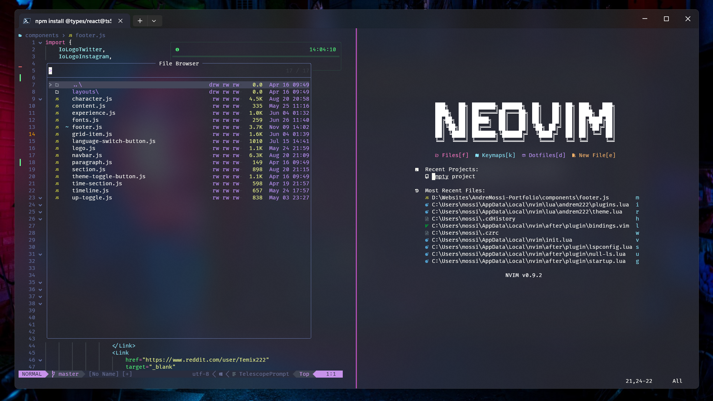

# Windows Dotfiles
<p align='center'>




</p>

> [!WARNING]
> Do not run the autosetup script in your computer if you do not know what it does.
> When run it will install and configure everything in your computer.
> Git cloning for powershell and nvim is used to make it fast to update when new changes are made
> The following is the link to the autosetup script: DO NOT RUN WITHOUT READING WHAT THE SCRIPT DOES
> ```
> Invoke-RestMethod https://raw.githubusercontent.com/AndreM222/Dotfile-Automizer/master/autoSetup.ps1 | Invoke-Expression
> ```

## Contents 📦

- Git Configuration

- Windows Terminal Configuration

- Linked Dotfiles

## Navigation ✈️

- [Navigate To Powershell Dotfiles <-](https://github.com/AndreM222/PowerShell) (For Detailed Setup)

- [Navigate To Neovim Dotfiles <-](https://github.com/AndreM222/nvim) (For Detailed Setup)

- [Navigate To Dotfile Automizer <-](https://github.com/AndreM222/Dotfile-Automizer) (For Detailed Setup)

## Dependencies 📃

- Git >= 2.19.0 (for partial clones support)

- Nerd Fonts >= 3.0

## Windows Terminal 🖥️

```
--- Split ---
(ctrl + alt + down) - Split Down
(ctrl + alt + up) - Split Up
(ctrl + alt + right) - Split Right
(ctrl + alt + left) - Split Left
```

```
--- Resize ---

(alt + shift + down) - Resize Down
(alt + shift + up) - Resize Up
(alt + shift + right) - Resize Right
(alt + shift + left) - Resize Left
```

```
--- Windows ---

(ctrl + shift + w) - Close Window
(ctrl + shift + t) - New Window
(ctrl + tab) - Switch Tab
(alt + shift + right) - Switch Split right
(alt + shift + left) - Switch Split left
(alt + shift + up) - Switch Split up
(alt + shift + down) - Switch Split down
```

```
Duplicate Split Pane:
https://learn.microsoft.com/en-us/windows/terminal/tutorials/new-tab-same-directory

Center On Startup:
https://learn.microsoft.com/en-us/windows/terminal/customize-settings/startup

Default Size Startup:
Columns: 190
Rows: 50

Opacity Config: 80

Font Size: 9
```

## Font 🖌️

- [FiraCode-NF-Mono](https://www.nerdfonts.com/font-downloads) - Font

## Theme 🎭

- [Dracula](https://draculatheme.com/windows-terminal) - Dracula Color Theme

## Terminal 📟

- [Windows terminal](https://apps.microsoft.com/store/detail/windows-terminal/9N0DX20HK701) - Terminal

## Shell 🛡️

- [PowerShell](https://apps.microsoft.com/detail/powershell/9MZ1SNWT0N5D?hl=en-us&gl=US) - Shell

## Setup ⚒️

##### Package Managers 📦

- [NVM | NodeJS](https://github.com/coreybutler/nvm-windows) - <span style="opacity:30%">npm</span>
```
winget install CoreyButler.NVMforWindows
nvm install lts
nvm use lts
```

##### Winget - Windows Installed

- [Git](https://git-scm.com/download/win) - `winget install Git.Git`

##### Scoop - Needs Installation

- [Fira-Font](https://github.com/ryanoasis/nerd-fonts) - `scoop install FiraCode-NF-Mono`

## Directory Structure 🗂️

```
📂$HOME
|__📄.gitconfig

📂 $HOME/AppData/Local/Nvim
|__📂lua/andrem222
|   |__📂 pluginDev
|   |   |__📑 All Personal Plugin Installation and Setup Files
|   |__📂 plugins
|   |   |__📑 All Plugin Installation and Setup Files
|   |__📄bindings.lua
|   |__📄config.lua
|   |__📄debug.lua
|   |__📄devconfig.lua
|   |__📄lazy.lua
|   |__📄theme.lua
|__📄init.lua

📂$HOME/Documents/PowerShell
|__📂themes
|   |__📄minimalNight.omp.json
|__📄Microsoft.PowerShell_profile.ps1
|__📄powershell.config.json
```

## Info ℹ️

<details>
<summary>Debugging 🐞</summary>

Problem: `Icons are not showing completly`

Fix:
```
Some fonts do not work well with some color themes and can cause that issue or the terminal.
You have to try until you find the right font, switch the theme, terminal or make tweaks by yourself. Generaly fonts ending with mono work.
```

</details>
